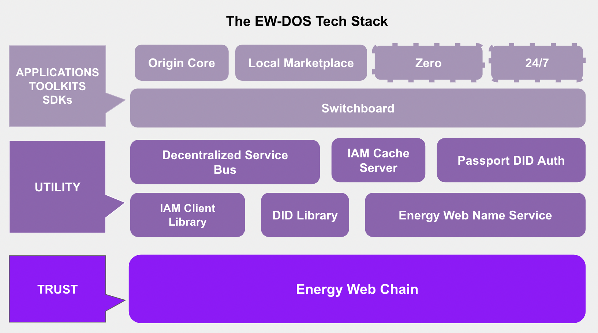

# Kickstarting the BLINGaton dev marathon

## What is Energy web blockchain? 

Energy web is a Proof Of Authority blockchain with major energy companies, think Engie, Fluvius and shell as validator nodes. The blockchain is a derivative of the Ethereum blockchain technology. This means it is possible to write smart contracts in [Solidity](https://soliditylang.org/) and write them in the popular [Remix IDE](https://remix.ethereum.org/), where you can compile and deploy your smart contracts to the chain. I'm currently researching the usage of smart contract frameworks to ease the compilation, deployement and introduse testing in our code.

Energy Web Decentralized Operating System (EW-DOS) is a system consisting of a mix of components. 



Examples services build on EW-DOS, to acces these you'll need to have a MetaMask. (see further)

[Switchboard](https://switchboard.energyweb.org/) Unified Self-Sovereign User Experience for the Decentralized Energy Ecosystem

[EasyBat](https://easybat-dev.energyweb.org/) Tracks the life cycle of home batteries

Note from editor: I played around with the EW DOS SDK, these packages are quite huge and extensive and written  in Nuxtjs/TypeScript. For the hackaton I guess we'll stick around with smart contracts, web3js and some front end framework to get things working. 

## Getting started with developing 

To interact with the blockchain you'll need a wallet to keep things easy install [MetaMask](https://metamask.io/). Every interaction with a blockchain will cost money so for development purposes we'll stick to the test network, in the case of EW this is [Volta](https://volta-explorer.energyweb.org/). With MetaMask installed it's time to connect: 

| Tablesname        | values           | 
| ------------- |:-------------:| 
| Network name      | volta | $1600 |
|RPC URL      | https://volta-rpc.energyweb.org      |   
| chain id |73799   |  
|Currency Symbol|VT| 
|Block explorer|http://volta-explorer.energyweb.org/ |

You're wallet is still empty so to receive some tokens to play around go to the [Volta Faucet](https://voltafaucet.energyweb.org/) and enter your MetaMask Address. 

You're set to build our first smart contract. A classic HelloWorld


On [Remix IDE](https://remix.ethereum.org/) you'll find a classic looking IDE. With Solidity smart contracts it is possible to write, compile and test them from the browser.

In the `File Explorers` create a new .sol file and paste the following code.

```
// SPDX-License-Identifier: MIT
// My First Smart Contract 
pragma solidity >=0.5.0 <0.7.0;
contract HelloWorld {
    function get()public pure returns (string memory){
        return 'Hello Contracts';
    }
}
```

After this compile the code with the default settings. 


In the  section it is possible to `Deploy and run` your contract. 

To deploy this contract on the Volta testnetwork choose the following settings. FOr the `Envirement` choose `Injected Web3`, with this option it is possible with MetaMask to sign your transaction and connect to Volta. You're account should be automatically selected. Choose your compiled `HelloWorld.sol` contract. Press on `Deploy`.

When pressing on `Deploy` a Metamask popup should appear to confirm this transaction. Deploying on a blockchain always takes a while so be patient. When the transaction was succesful the information will appear in the terminal. We can check this transaction on the chain [click](https://volta-explorer.energyweb.org/tx/0x426b3d4c5d879b459b8d9f4ff0641c74cc4da07c30c0cc9dda8deee2db4b218e/internal-transactions) and even see the [contract](https://volta-explorer.energyweb.org/address/0x7442D64B7FAB9eEE8caA3ca44eD77f758CA298a7/transactions), we can even publish our code instead of the compiled bytecode. 


sources:
https://www.geeksforgeeks.org/hello-world-smart-contract-in-remix-ide/
https://energy-web-foundation.gitbook.io/
